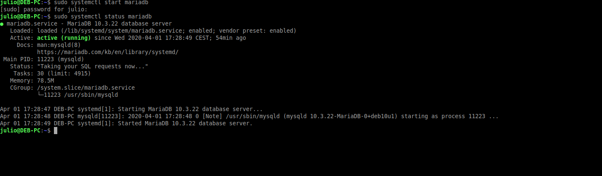
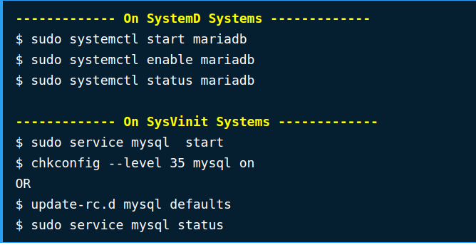
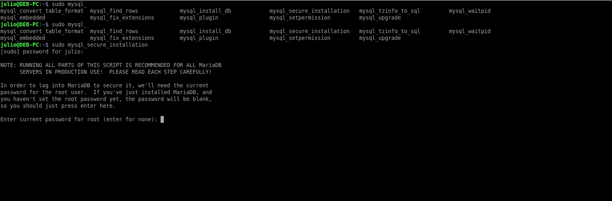
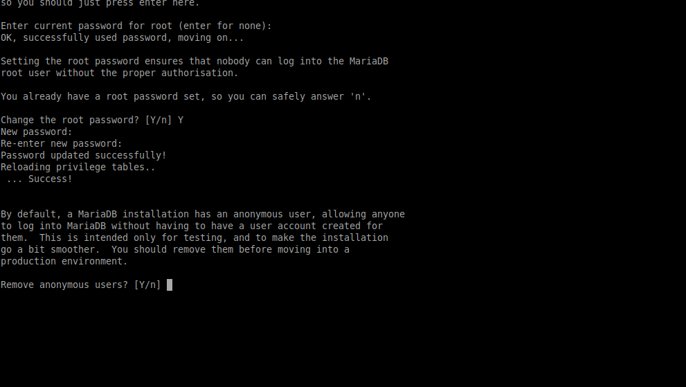
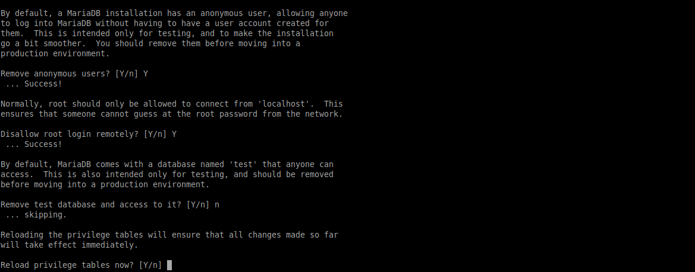
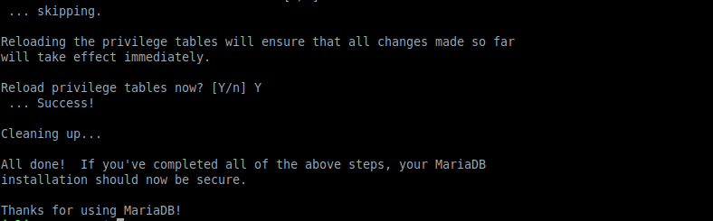
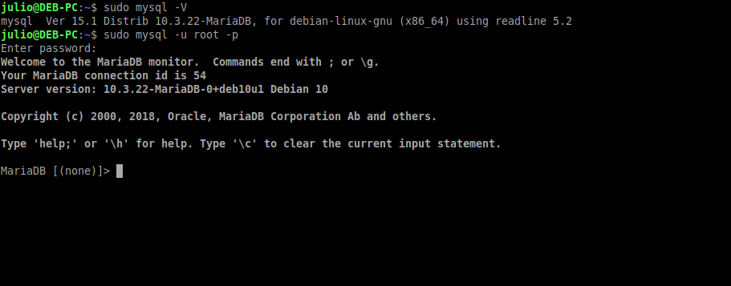
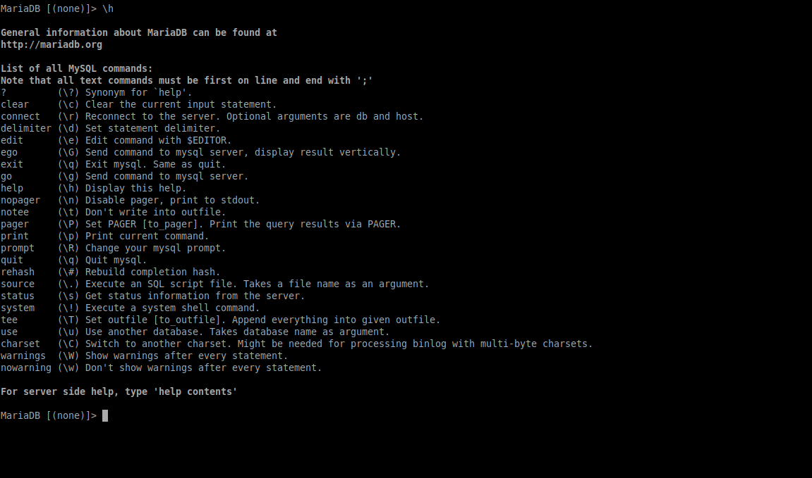

# Proceso de instalación de MariaDB en Debian 10 :notebook:   

## Recursos
- [Instalación de MariaDB en Ubuntu y Debian](https://www.tecmint.com/install-mariadb-in-ubuntu-and-debian/)
- [Documentación de MariaDB](https://mariadb.com/kb/en/documentation/)
- [Tutorial de MariaDB para iniciantes](https://mariadb.com/kb/en/a-mariadb-primer/)

MariaDB es un SGBD (Sistema Gestor de Bases de Datos) creado como un [fork de MySQL](https://github.com/MariaDB/server) por sus propios desarrolladores, como una alternativa
opensource que permita utilizar las características que ofrece MySQL junto a otras que además mejoran el funcionamiento del gestor. MariaDB ofrece una [compatibilidad](https://mariadb.com/kb/en/mariadb-vs-mysql-compatibility/) casi al completo con MySQL, sumando a mayores extensiones y correción de errores más frecuente que no se encuentran en MySQL.

Por defecto Debian tiene a MariaDB en sus [repositorios](https://packages.debian.org/sid/mariadb-server), por lo que para una mayor compatibilidad con el sistema se hace la instalación utilizando los repositorios oficiales de la distribución.

### Pasos a seguir

Lo primero que debemos hacer antes de instalar cualquier programa en una distribución es actualizar la lista de repositorios, que contienen la útlima versión estable de éstos, y asegurarnos
de que tenemos el sistema actualizado para evitar algún conflicto de versiones entre librerías y demás paquetes. Para actualizar la lista de repositorios y el sistema ejecutamos en una terminal:

```sh
sudo apt update; sudo apt dist-upgrade -y
```

Una vez hemos hecho esto procedemos a instalar MariaDB ejecutando la siguiente instrucción: 
```sh
sudo apt install mariadb-server -y
```

Podemos ver todos los paquetes que tenemos disponibles desde los repositorios escribiendo el anterior comando y pulsando dos veces tabulación:


Lo siguiente es iniciar el servicio y activarlo para que se autoinicie cuando se inicie sesión. Ejecutamos:
```sh
sudo systemctl start mariadb

# Si el servicio no está activado ejecutamos `sudo systemctl enable mariadb`
```

Una vez iniciado vemos el estado para comprobar que no hubo ningún problema:

```sh
sudo systemctl status mariadb
```




:warning: En sistemas basados en SysVinit el inicio y activado del servicio se realiza ejecutando los siguientes comandos:


```sh
sudo service mysql start; chkconfig --level 35 mysql on

# Para saber qué administrador de servicios utiliza nuestro sistema ejecutamos: `pstree -p`. El primer proceso en iniciarse es el del administrador.
```



Una vez instalado e iniciado el servicio sólo nos queda configurarlo mínimamente para que sea más seguro. Esto lo hacemos con un script que viene por defecto 
con la instalación: `mysql_secure_installation`.

```sh
sudo mysql_secure_installation
```



Lo primero que nos pide es la contraseña del usuario root del gestor. Como aún no le hemos establecido ninguna contraseña, simplemente presionamos enter.

Lo siguiente que nos pide es si queremos cambiarla. Tecleamos 'Y' y la cambiamos. A continuación nos dice si queremos eliminar el usuario anónimo (un usuario creado por
defecto para hacer pruebas en el gestor). Tecleamos 'Y' y lo eliminamos:



Lo siguiente que nos pregunta es si queremos deshabilitar el inicio de sesión con el usuario root en remoto. Por seguridad mejor lo deshabilitamos. A continuación nos pregunta
si queremos eliminar la base de datos de prueba creada en la instalación. Para luego probar el funcionamiento del gestor por ahora no la eliminamos.

Finalmente nos pide confirmación para guardar los cambios hechos:




Ahora que ya tenemos el gestor mínimamente configurado, procederemos a conectarnos. Ejecutamos:

```sh
sudo mysql -u root -p
```



Ayuda en la terminal:



Bases de datos y tablas:


