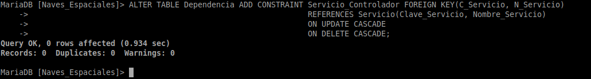

# Exercicio DDL 2 Naves espaciais

O Ministerio da Exploración Interplanetaria da Federación Unida de Planetas desexa desenvolver un Sistema de Información para a nave espacial Stanisław Lem 72 que proximamente se lanzará ao espazo.

A nave espacial componse de distintas dependencias, e cada unha delas ten un nome, un código (único para cada dependencia), unha función e unha localización. Cada dependencia está baixo o control dun determinado servizo, identificado por un nome e unha clave. Todo servizo da nave (Servizo de Operacións, Comando e Control, Seguridade, etc.) ha de estar asignado polo menos a unha dependencia.

Quérese levar ao día unha relación da tripulación da nave. Esta información contén o nome, código, categoría, antigüidade, procedencia e situación administrativa (en servizo, de baixa, etc). Cada tripulante está asignado a unha dependencia que desexa coñecer, así como a cámara na que se aloxa. Unha cámara é unha dependencia que posúe dúas características propias, a súa categoría e a súa capacidade.

Doutra banda, deséxanse coñecer os planetas que visitou cada membro da tripulación e o tempo que permaneceron neles para saber as persoas con quen se pode contar á hora de realizar unha exploración interplanetaria.

De cada planeta coñécese o seu nome e código, a galaxia e coordenadas nas que se atopa. Algúns planetas atópanse poboados por diversas razas, cada unha nunha certa cantidade de individuos. De cada raza almacénase información sobre o nome, poboación total e dimensións medias (altura, anchura, peso).

## Esquema del ejercicio normalizado


## Implementación en MariaDB

**Lo primero que haremos será crear la estructura de la base de datos. La llamaremos 'Naves_Espaciales':**

```SQL
CREATE DATABASE Naves_Espaciales CHARACTER SET = utf8 COLLATE = utf8_general_ci;
```


**Después de crear la estructura, procedemos a crear las tablas.**

### Creación de tablas

#### Tabla Dependencia:

```SQL
CREATE TABLE Dependencia (
    Código_Dependencia       VARCHAR(50) PRIMARY KEY,
    Nombre_Dependencia       VARCHAR(50) NOT NULL UNIQUE,
    Función_Dependencia      VARCHAR(50) NOT NULL,
    Localización_Dependencia VARCHAR(50) NOT NULL,
    C_Servicio               CHAR(5),
    N_Servicio               VARCHAR(50)
);
```


#### Tabla Servicio:

```SQL
CREATE TABLE Servicio (
    Clave_Servicio  CHAR(5),
    Nombre_Servicio VARCHAR(50),
    CONSTRAINT PK_Servicio PRIMARY KEY (Clave_Servicio, Nombre_Servicio)
);
```


#### Tabla Tripulación:

```SQL
CREATE TABLE Tripulación (
    Código_Tripulación       CHAR(6) PRIMARY KEY,
    Nombre_Tripulación       VARCHAR(50) NOT NULL UNIQUE,
    Categoría_Tripulación    VARCHAR(50),
    Antiguedad               INTEGER,
    Procedencia              VARCHAR(50),
    Situación_Administrativa VARCHAR(50),
    C_Dependencia            VARCHAR(50),
    C_Cámara                 CHAR(5)
);
```


#### Tabla Cámara:

```SQL
CREATE TABLE Cámara (
    Código_Dependencia_Cámara CHAR(5) PRIMARY KEY,
    Categoría_Cámara VARCHAR(50),
    Capacidad_Cámara INTEGER,
    CONSTRAINT FK_Cámara FOREIGN KEY (Código_Dependencia_Cámara)
                         REFERENCES Dependencia(Código_Dependencia)
                         ON UPDATE CASCADE
                         ON DELETE CASCADE
);
```


#### Tabla Visita:

```SQL
CREATE TABLE Visita (
    C_Tripulación CHAR(6),
    C_Planeta     CHAR(5),
    Fecha_Visita       DATE,
    Tiempo_Visita      INTEGER,
    PRIMARY KEY (C_Tripulación, C_Planeta, Fecha_Visita)
);
```


#### Tabla Planeta:

```SQL
CREATE TABLE Planeta (
    Código_Planeta      CHAR(5) PRIMARY KEY,
    Nombre_Planeta      VARCHAR(50) NOT NULL UNIQUE,
    Galaxia_Planeta     VARCHAR(50),
    Coordenadas_Planeta VARCHAR(50) NOT NULL UNIQUE
);
```


#### Tabla Habita:

```SQL
CREATE TABLE Habita (
    C_Planeta CHAR(5),
    N_Raza VARCHAR(50),
    Población_Parcial INTEGER NOT NULL,
    PRIMARY KEY (C_Planeta, N_Raza)
);
```


#### Tabla Raza:

```SQL
CREATE TABLE Raza (
    Nombre_Raza     VARCHAR(50) PRIMARY KEY,
    Altura          DECIMAL,
    Anchura         DECIMAL,
    Peso            DECIMAL,
    Población_Total INTEGER NOT NULL
);
```


### Restricciones

**Después de haber creado las tablas nos toca añadir las restricciones para terminar de relacionar las tablas entre sí y que la entrada de datos cumpla con lo que queremos.**

#### Dependencia

**La tabla dependencia tiene dos claves ajenas: C_Servicio y N_Servicio, que corresponden a la clave primaria de la tabla Servicio, compuesta por los atributos Clave_Servicio**
**y Nombre_Servicio. El enunciado también nos dice que cada dependencia está bajo el control de un servicio, por lo que esta clave foránea tampoco podrá ser nula. Creamos**
**una restricción de clave foránea:**

```SQL
ALTER TABLE Dependencia MODIFY C_Servicio CHAR(5) NOT NULL;
ALTER TABLE Dependencia MODIFY N_Servicio VARCHAR(50) NOT NULL;
ALTER TABLE Dependencia ADD CONSTRAINT Servicio_Controlador FOREIGN KEY(C_Servicio, N_Servicio)
                                                            REFERENCES Servicio(Clave_Servicio, Nombre_Servicio)
                                                            ON UPDATE CASCADE
                                                            ON DELETE CASCADE;
```



#### Tripulación

**La tabla tripulación tiene dos claves foráneas que nombramos como C_Dependencia y C_Cámara, y que corresponden a la clave primaria de la tabla Dependencia (Código_Dependencia)**
**y a la clave primaria de la tabla Cámara (Código_Cámara), respectivamente. Creamos una restricción de clave foránea:**

```SQL
ALTER TABLE Tripulación ADD CONSTRAINT Dependencia FOREIGN KEY (C_Dependencia)
                                                   REFERENCES Dependencia(Código_Dependencia)
                                                   ON UPDATE CASCADE
                                                   ON DELETE CASCADE;
ALTER TABLE Tripulación ADD CONSTRAINT Cámara FOREIGN KEY (C_Cámara)
                                                   REFERENCES Cámara(Código_Dependencia_Cámara)
                                                   ON UPDATE CASCADE
                                                   ON DELETE CASCADE;
```


#### Cámara

**La tabla Cámara tiene un atributo llamado Capacidad_Cámara, de tipo entero. Cuando el tipo de dato INT (o INTEGER) está asignado, comprende valores desde -2147483648 hasta 2147483647.**
**No podemos permitir que la capacidad de una cámara tenga un valor negativo, por lo que establecemos una restricción de verificación para sus valores:**

```SQL
ALTER TABLE Cámara MODIFY Capacidad_Cámara INTEGER CHECK (Capacidad_Cámara > 0);
```


#### Visita

**La tabla Visita tiene una clave primaria compuesta por los atributos C_Tripulación, C_Planeta y Fecha_Visita. C_Tripulación corresponde a la clave primaria de la tabla Tripulación (Código_Tripulación).**
**C_Planeta corresponde a la clave primaria de la tabla Planeta (Código_Planeta). Hemos declarado que la clave primaria está compuesta por esos tres atributos, por lo que no hace falta poner**
**la restricción de obligatoriedad ni la de unicidad. Así mismo, la tabla Visita tiene un atributo llamado Tiempo_Visita, de tipo entero y que no debería tener valores negativos.**
**Creamos las restricciones de clave foránea y la de verificación:**

```SQL
ALTER TABLE Visita ADD CONSTRAINT Tripulación FOREIGN KEY (C_Tripulación)
                                              REFERENCES Tripulación(Código_Tripulación)
                                              ON UPDATE CASCADE
                                              ON DELETE CASCADE;
ALTER TABLE Visita ADD CONSTRAINT Planeta FOREIGN KEY (C_Planeta)
                                              REFERENCES Planeta(Código_Planeta)
                                              ON UPDATE CASCADE
                                              ON DELETE CASCADE;
ALTER TABLE Visita MODIFY Tiempo_Visita INTEGER CHECK (Tiempo_Visita > 0);
```


#### Habita

**La tabla Habita tiene una clave primaria compuesta por los atributos C_Planeta y N_Raza, que se correponden con la clave primaria de la tabla Planeta (Código_Planeta) y la clave primaria**
**de la tabla Raza (Nombre_Raza). Creamos las restricciones de clave foránea:**

```SQL
ALTER TABLE Habita ADD CONSTRAINT Planeta_Raza FOREIGN KEY (C_Planeta)
                                               REFERENCES Planeta(Código_Planeta)
                                               ON UPDATE CASCADE
                                               ON DELETE CASCADE;

ALTER TABLE Habita ADD CONSTRAINT Nombre_Raza FOREIGN KEY (Nombre_Raza)
                                              REFERENCES Raza(Nombre_Raza)
                                              ON UPDATE CASCADE
                                              ON DELETE CASCADE;
```

---

- **El código final está modificado, por lo que algunas imágenes muetran diferencias en la ejecución respecto al código.**
- **VARCHAR y CHAR se utilizan indiferentemente. Se podría utilizar CHAR como tipo de datos para las cadenas, pero para ver la variedad en los tipos se ha optado por utilzar ambos.**
- **[Gist con el código completo modificado](https://gist.github.com/Jul10-S/c6c4be5e6978fdfc14941ab79a81ce2b)**