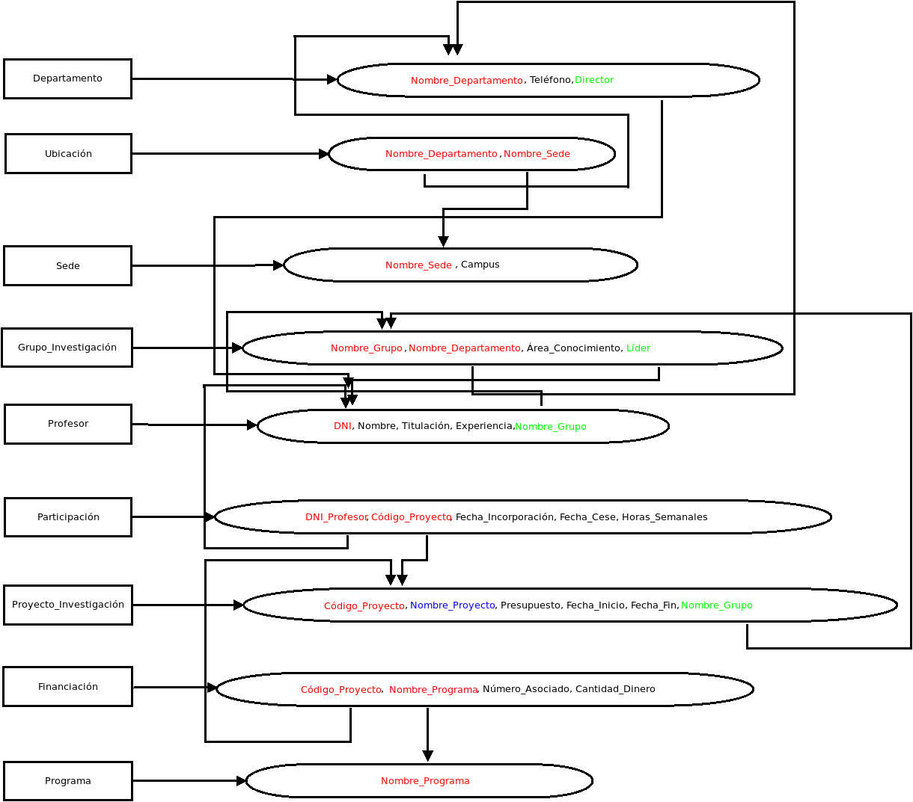
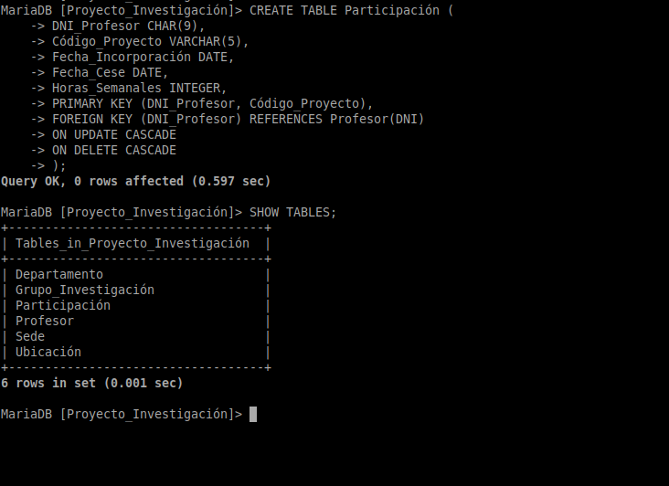

# Exercicio DDL 1 - Proxectos de investigación

Na Universidade de A Coruña deséxase levar un control sobre os proxectos de investigación que se desenvolven. Para iso decídese empregar unha base de datos que conteña toda a información sobre os proxectos, departamentos, grupos de investigación e profesores.

Un departamento identifícase polo seu nome (Informática, Enxeñería, etc). Ten unha sede situada nun determinado campus, un teléfono de contacto e un director, tamén profesor da Universidade de A Coruña.

Dentro dun departamento créanse grupos de investigación. Cada grupo ten un nome único dentro do departamento (pero que pode ser o mesmo en distintos departamentos) e está asociado a unha área de coñecemento (bases de datos, intelixencia artificial, sistemas e comunicacións, etc). Cada grupo ten un líder, tamén profesor da Universidade de A Coruña.

Un profesor está identificado polo seu DNI. Del deséxase saber o nome, tilulación, anos de experiencia en investigación, grupo de investigación no que desenvolve o seu labor e proxectos nos que traballa.

Cada proxecto de investigación ten un nome, un código único, un orzamento, datas de inicio e terminación e un grupo que o desenvolve. Doutra banda, pode estar financiado por varios programas. Dentro de cada programa cada proxecto ten un número asociado e unha cantidade de diñeiro financiada (por exemplo, o proxecto BDE - Bases de Datos Espaciais ten o número 1337 dentro do programa A Solaris e volta que lle financia con 10.000 euros).

Un profesor pode participar en varios proxectos. En cada proxecto incorpórase nunha determinada data e cesa noutra, tendo unha determinada dedicación (en horas á semana) durante ese período.

## Esquema Entidad-Relación


## Esquema normalizado



## Implementación en MariaDB

**Lo primero que haremos será crear la estructura de la base de datos. La llamaremos 'Proyecto_Investigación':**

```SQL
CREATE DATABASE Proyecto_Investigación CHARACTER SET = utf8 COLLATE = utf8_general_ci;
```


**Después de crear la estructura, procedemos a crear las tablas.**

### Creación de tablas

#### Departamento

```SQL
CREATE TABLE Departamento (
    Nombre_Departamento VARCHAR(50) PRIMARY KEY,
    Teléfono            VARCHAR(9)
);

/*
Departamento tiene una clave foránea llamada Director, que añadiremos más adelante en forma de restricción dado que si lo hacemos ahora el gestor dará un error al no existir dicha clave en el
momento de crear la tabla. De todas maneras, podríamos crear antes la tabla que contiene la clave foránea, pero esa tabla puede que también dependa de otra y así sucesivamente, por lo que es
más eficiente añadir las claves foráneas al final.
*/
```


#### Sede

```SQL
CREATE TABLE Sede (
    Nombre_Sede VARCHAR(50) PRIMARY KEY,
    Campus      VARCHAR(50) NOT NULL
);
```


#### Ubicación

```SQL
 CREATE TABLE Ubicación (
    Nombre_Departamento VARCHAR(50),
    Nombre_Sede         VARCHAR(50),
    CONSTRAINT PK_Ubicación PRIMARY KEY (Nombre_Departamento, Nombre_Sede),
    FOREIGN KEY (Nombre_Departamento) REFERENCES Departamento(Nombre_Departamento) 
    ON UPDATE CASCADE 
    ON DELETE CASCADE,
    FOREIGN KEY (Nombre_Sede) REFERENCES Sede(Nombre_Sede) 
    ON UPDATE CASCADE 
    ON DELETE CASCADE
);

-- Como Ubicación está compuesta únicamente por claves foráneas optamos por crear directamente las restricciones ya que además las tablas de las que depende están creadas.
```


#### Grupo_Investigación

```SQL
CREATE TABLE Grupo_Investigación (
    Nombre_Grupo        VARCHAR(50),
    Nombre_Departamento VARCHAR(50),
    Área_Conocimiento   VARCHAR(50) NOT NULL,
    CONSTRAINT PK_Grupo_Investigación PRIMARY KEY(Nombre_Grupo, Nombre_Departamento),
    FOREIGN KEY (Nombre_Departamento) REFERENCES Departamento(Nombre_Departamento) 
    ON UPDATE CASCADE 
    ON DELETE CASCADE
);
```


#### Profesor

```SQL
 CREATE TABLE Profesor (
    DNI            CHAR(9) PRIMARY KEY,
    Nombre         VARCHAR(50) NOT NULL,
    Titulación     VARCHAR(50) NOT NULL,
    Experiencia    INTEGER,
    N_Grupo        VARCHAR(50),
    N_Departamento VARCHAR(50),
    CONSTRAINT FK_Grupo_Profesor FOREIGN KEY (N_Grupo, N_Departamento) REFERENCES Grupo_Investigación(Nombre_Grupo, Nombre_Departamento)
    ON UPDATE CASCADE 
    ON DELETE SET NULL  -- Un profesor puede salir de un grupo de investigación sin que ello implique el borrado de sus datos.
);

/*
Estamos referenciando la clave primaria de la tabla Grupo_Investigación, que está compuesta por dos atributos, por lo que a la hora de referenciar la clave compuesta también
debemos crear los atributos en la tabla que referenciarán a los que componen la clave primaria referenciada.
*/
```


#### Participación

```SQL
 CREATE TABLE Participación (
    DNI_Profesor CHAR(9),
    Código_Proyecto CHAR(5),
    Fecha_Incorporación DATE,
    Fecha_Cese DATE,
    Horas_Semanales INTEGER NOT NULL,
    PRIMARY KEY (DNI_Profesor, Código_Proyecto),
    FOREIGN KEY (DNI_Profesor) REFERENCES Profesor(DNI) 
    ON UPDATE CASCADE
    ON DELETE NO ACTION -- Si se llega a eliminar un profesor aún podríamos necesitar saber quién participaba.
);

```



#### Proyecto_Investigación

```SQL
CREATE TABLE Proyecto_Investigación (
    Código_Proyecto CHAR(5) PRIMARY KEY, 
    Nombre_Proyecto VARCHAR(50) NOT NULL,
    Presupuesto INTEGER,
    Fecha_Inicio DATE,
    Fecha_Fin    DATE,
    N_Grupo VARCHAR(50),
    N_Departamento VARCHAR(50),
    CONSTRAINT FK_Grupo_Investiga FOREIGN KEY (N_Grupo, N_Departamento) REFERENCES Grupo_Investigación(Nombre_Grupo, Nombre_Departamento)
    ON UPDATE CASCADE 
    ON DELETE NO ACTION
);
```


#### Financiación

```SQL
CREATE TABLE Financiación (
    Código_Proyecto VARCHAR(5),
    Nombre_Programa VARCHAR(50),
    Número_Asociado INTEGER NOT NULL,
    Cantidad_Dinero INTEGER NOT NULL,   -- Lo más correcto sería un tipo de datos 'MONEY', pero en MariaDB no existe así que se pone un simple entero.
    CONSTRAINT PK_Financiación PRIMARY KEY (Código_Proyecto, Nombre_Programa),
    FOREIGN KEY (Código_Proyecto) REFERENCES Proyecto_Investigación(Código_Proyecto) 
    ON UPDATE CASCADE
    ON DELETE CASCADE
);

```


#### Programa

```SQL
CREATE TABLE Programa (Nombre_Programa VARCHAR(50) PRIMARY KEY);
```


### Restricciones

**Después de haber creado las tablas nos toca añadir las restricciones para terminar de relacionar las tablas entre sí y que la entrada de datos cumpla con lo que queremos.**

**Empezando por la tabla Departamento, tenemos una clave foránea llamada 'Director', que corresponde a la clave primaria de la tabla Profesor. Añadimos la restricción de clave foránea:**

```SQL
ALTER TABLE Departamento ADD COLUMN Director CHAR(5); -- Primero añadimos la columna
ALTER TABLE Departamento ADD CONSTRAINT FK_Director FOREIGN KEY (Director) REFERENCES Profesor(DNI)
                                                    ON UPDATE CASCADE
                                                    ON DELETE SET NULL;
```


**Tabla Grupo_Investigación:**

```SQL
ALTER TABLE Grupo_Investigación ADD COLUMN Líder CHAR(9);
ALTER TABLE Grupo_Investigación ADD CONSTRAINT FK_Profesor_Grupo FOREIGN KEY (Líder) REFERENCES Profesor(DNI)
                                                   ON UPDATE CASCADE
                                                   ON DELETE SET NULL;
```


**Tabla Profesor:**

```SQL
ALTER TABLE Profesor ADD CONSTRAINT Experiencia CHECK (Experiencia BETWEEN 1 AND 50);
```


**Tabla Participación:**

```SQL
ALTER TABLE Participación ADD CONSTRAINT FK_Código_Proyecto FOREIGN KEY (Código_Proyecto) REFERENCES Proyecto_Investigación(Código_Proyecto) 
                                                            ON UPDATE CASCADE
                                                            ON DELETE NO ACTION;

ALTER TABLE Participación ADD CONSTRAINT Comprobación_Fechas CHECK (Fecha_Incorporación < Fecha_Cese); -- La fecha de incorporación no puede ser mayor a la del cese
```


**Tabla Proyecto_Investigación:**

```SQL
ALTER TABLE Proyecto_Investigación ADD CONSTRAINT Comprobación_Presupuesto CHECK (Presupuesto > 0);
ALTER TABLE Proyecto_Investigación ADD CONSTRAINT Comprobación_Fechas CHECK (Fecha_Inicio < Fecha_Fin);
ALTER TABLE Proyecto_Investigación ADD CONSTRAINT Unicidad_Nombre UNIQUE(Nombre_Proyecto);
```


**Tabla Financiación:**

```SQL
ALTER TABLE Financiación ADD CONSTRAINT FK_Nombre_Programa FOREIGN KEY (Nombre_Programa) REFERENCES Programa(Nombre_Programa) 
                                                            ON UPDATE CASCADE
                                                            ON DELETE CASCADE;
ALTER TABLE Financiación ADD CONSTRAINT Unicidad_Asociado UNIQUE(Número_Asociado);
```


---

- [Gist con el código completo modificado](https://gist.github.com/juliospau/132d8fba1c4cad887d45dbbcce9a501a)

