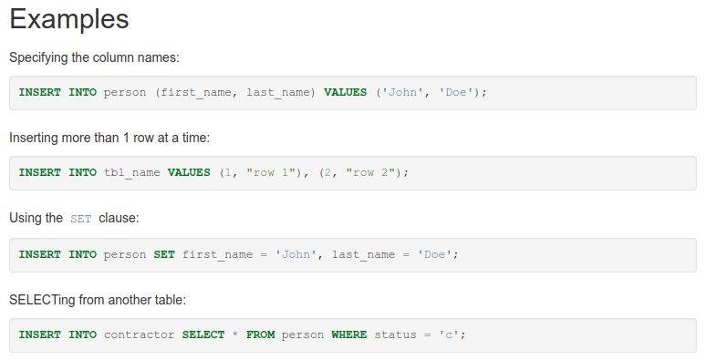

# DML (Data Manipulation Language)

**Este sublenguaje de SQL nos permite alterar los datos de nuestra BBDD. Sus principales cláusulas son:**

CLÁUSULA | FUNCIÓN |
-------- | ------- |
**`INSERT`** | Se utiliza para insertar nuevas tuplas en una tabla existente |
**`UPDATE`** | Nos permite actualizar el/los dato/s de la/s columna/s de una tabla existente |
**`DELETE`** | Nos permite eliminar tuplas de una tabla existente |
--------------------

- **En versiones anteriores de SQL, DML incluía `SELECT` entre sus cláusulas, pero al crearse DQL éste ya no lo incluye. Sin embargo, en MariaDB aún se incluye `SELECT` como**
**parte de las cláusulas de DML.**
- **[Más información sobre DML en MariaDB](https://mariadb.com/kb/en/data-manipulation/)**

## `INSERT`
### Fórmula

```SQL
INSERT INTO <Nombre_Tabla> (<atributo1>, <atributo2>, <atributon>) VALUES (<valor1-1>, <valor1-2>, <valor1-n>),
		                                                                  (<valor2-1>, <valor2-2>, <valor2-n>),
                                                                          (<valorN-1>, <valorN-2>, <valorN-n>)
;
```

- **Se puede obviar la especificación de los atributos. En ese caso, los valores introducidos se irán guardando según el orden de los atributos en la tabla, por lo que al hacerlo**
**de ésta manera, habería que saber de antemano el orden de los atributos y su dominio.**
- **También se podría introducir datos mediante consultas a otras tablas de la BBDD:**

```SQL
INSERT INTO <Nombre_Tabla> (<atributo1>, <atributo2>, <atributon>) SELECT (atributo1, atributo2, atributon)
                                                                   FROM (Nombre_Otra_Tabla)
                                                                   WHERE (predicado);
```

Ejemplos en MariaDB:



## `UPDATE`
### Fórmula

```SQL
UPDATE Nombre_Tabla SET <atributo1> = <valor1>,
                        <atributo2> = <valor2>,
                        <atributon> = <valorn>
                        
                        WHERE (predicado);  -- Con WHERE podemos especificar la condición que deben cumplir las tuplas para ser actualizadas, con lo que podemos llegar a delimitar la/s tupla/s
                                            -- en concreto que queremos modificar. Si no llegamos a especificar una condición, todas las tuplas de la tabla serán actualizadas.
```

## `DELETE`
### Fórmula

```SQL
DELETE FROM Nombre_Tabla WHERE (predicado); -- Eliminará cada tupla que cumpla con la condición. Si no se especifica un predicado, se eliminará toda la tabla.
                                            -- Hay que tener en cuenta que cuando empleamos un predicado estamos disponiendo de todo SQL-DQL, por lo que el predicado de una eliminación de tuplas
                                            -- bien podría ser hasta toda una subconsulta.
```
