# Apuntes de SQL :notebook:

## **Historia y recursos**

- [Qué es una BBDD y SQL](https://www.youtube.com/watch?v=FR4QIeZaPeM "DDBB & SQL")
- [Historia de SQL](https://es.wikipedia.org/wiki/SQL "Historia de SQL en Wikipedia")
- [Ejemplos de los apuntes](https://sqlzoo.net/ "Ejemplos en SQLZoo")

## **Sublenguajes de SQL**

SQL es un único lenguaje compuesto de sublenguajes que pueden realizar por separado o conjuntamente con otros sublenguajes distintas operaciones que el usuario le pida.

Estos sublenguajes son:

- **`DQL (Data Query Language)`**: Este sublenguaje se encarga de las consultas de los usuarios (obtener las columnas -atributos- de una tabla, obtener tuplas con información de una columna o la tabla al completo...).
  - **`SELECT`**
- **[`DML (Data Manipulation Language)`](./SQL-DML.md)**: Este sublenguaje se encarga de manipular los datos de la base de datos. Permite, por ejemplo, insertar nuevos datos en una columna.
  - **`INSERT, UPDATE, DELETE` -> En versiones anteriores de SQL incluía `SELECT`**
- **[`DDL (Data Definition Language)`](./SQL-DDL.md)**: Este sublenguaje nos permite definir las características u objetos de la base de datos. Podemos, por ejemplo, crear o eliminar tablas.
  - **`CREATE, ALTER, DROP, TRUNCATE, RENAME`**
- **`DCL (Data Control Language)`**: Permite definir controles de seguridad sobre datos u objetos de la base de datos. Con este sublenguaje se puede dar o revocar permisos a los usuarios para que puedan o no acceder a ciertos datos o realizar alguna operación.
  - **`GRANT, REVOKE`**
- **`TCL (Transaction Control Language)`**: Nos permite hacer transacciones (conjunto de operaciones sobre datos u objetos).
  - **`COMMIT, ROLLBACK, SAVEPOINT`**
- **`SCL (Session Control Language)`**: Permite manejar de manera dinámica la sesión de un usuario. La sesión de un usuario se entiende como la representación lógica de una conexión entre la base de datos y un usuario. Con este lenguaje se puede modificar condiciones o parámetros de una sesión activa.
  - **`ALTER SESSION, SET ROLL`**

## DQL (Data Query Language)

El sublenguaje DQL nos permite obtener datos de una base de datos mediante consultas a ésta. Podemos utilizarlo para saber, por ejemplo, los nombres de los países de una supuesta tabla llamada 'world', que contiene todos los países del mundo.

Las consultas que podemos hacer consisten en una combinación de su principal función, **`SELECT`**, y la función **`FROM`**, con la que indicamos desde qué tabla queremos sacar los datos que queremos y que previamente hemos indicado en el **`SELECT`**.

Sólo con estas dos funciones podemos obtener infinidad de datos de un BBDD, aunque al final se quedan cortas para los numerosos casos en los que queremos consultar, por ejemplo, datos que cumplan un cierto criterio. Para éstos casos podemos combinar las funciones anteriores con la función **`WHERE`**, que nos permite indicar una condición (o varias) que deben cumplir los datos que queremos, y ésto se lo indicamos en forma de predicados.

Supongamos la siguiente tabla de una BBDD de ejemplo tomada de [SQLZoo](https://sqlzoo.net/ "SQLZoo"):

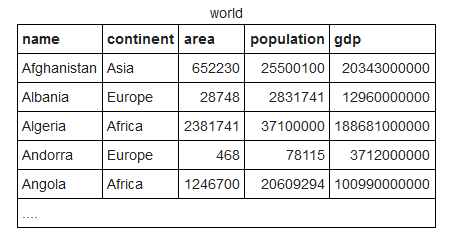

La tabla está compuesta de cinco columnas **(name, continent, area, population y gdp)** y contiene tuplas de información relacionada con la semántica de ésas columnas. Si quisiéramos saber, por ejemplo, todos los países de África, lo primero que haríamos sería seleccionar los datos que queremos (en este caso **name**), luego de dónde lo queremos (estamos trabajando con la tabla '**world**' así que la elegimos) y finalmente le decimos que queremos los países que estén en el continente africano (este es el predicado). La consulta quedaría así:

```SQL
SELECT name
FROM world
WHERE continent = 'Africa'
ORDER BY name;
/*Utilizamos el comparador '=' para comprobar que 'continent' es exactamente igual a 'Africa' y
finalmente ordenamos la lista por orden alfabético (por defecto con el valor ASC pero
podemos especificar que sea DESC, así los ordenará por orden inverso: ORDER BY name DESC).
*/
```

- Las consultas SQL siempre acaban en **;**.
- Las cláusulas y funciones de SQL se pueden escibir en minúsculas o mayúsculas. Esto puede variar en el caso de los nombres de las tablas o columnas dependiendo
del sistema gestor.
- **`SELECT`** filtra columnas, **`WHERE`** filtra tuplas.
- Para poner comentarios de una línea utilizamos doble guión: ```--COMENTARIO``` y para los de varias líneas los encerramos en barra y asterisco:

```plaintext
/*
COMENTARIO 1
COMENTARIO 2
COMENTARIO 3
...
*/
```

---

- **Operador asterico (*):** es un comodín que significa todo el contenido.

```SQL
SELECT *
FROM world;
```

---

Si queremos, por ejemplo, saber a qué continente pertenece Australia y sabemos que está en una lista dada de continentes utilizamos la cláusula **`IN`**:

```SQL
SELECT name, continent AS c
FROM world
WHERE name = 'Australia' AND c IN ('Africa', 'Oceania', 'Asia');
```

- Podemos selccionar varias columnas de una tabla simplemente separando sus nombres por comas.
- Para que el código sea más legible, podemos renombrar las columnas para nuestra consulta con **`AS`**.
- Para concatenar predicados utilizamos la cláusula **`AND`**.

```SQL
SELECT name, population
FROM world
WHERE name in ('Sweden', 'Norway', 'Denmark', 'Russia')
ORDER BY population ASC;
```

Otra cláusula que podemos utilizar para enfocar aún más nuestra consulta es **`BETWEEN`**. Con esta cláusula podemos indicar que queremos valores comprendidos en un rango en concreto.
Por ejemplo, si quisiéramos saber qué países del continente asiático tienen una población total de entre 25 y 50 millones ejecutamos la siguiente consulta:

```SQL
SELECT upper(name), population
FROM world
WHERE continent = 'Asia' AND population BETWEEN 25000000 AND 50000000;

/*
Con la función 'upper' le indicamos que queremos el nombre de los países en mayúsculas. También disponemos de la función lower(),
que hace lo contrario.
*/
```

```SQL
SELECT name, population
FROM world
WHERE population BETWEEN 50000000 AND 100000000
ORDER BY population;
```

```SQL
SELECT name AS Nombre, area
FROM world
WHERE name BETWEEN 'D' AND 'F';

--WHERE name >= 'D' AND <= 'F';
```

Otra cláusula es **`ROUND`**, que nos permite redondear valores numéricos:

```SQL
SELECT name, ROUND(gdp, -6)
FROM world
WHERE continent = 'Asia';
/*
Como primer argumento se incluye el nombre de la columna que contiene los datos que queremos y como segundo argumento incluimos
la cantidad de números que queremos redondear. Si utilizamos valores positivos redondearemos los decimales; con valores negativos
redondeamos la parte entera (se convierten en 0 los números que estén en ese rango que elegimos)
*/
```

Si queremos saber la longitud de una cadena podemos emplear la cláusula **`LENGTH`**:

```SQL
SELECT LENGTH(name), name
FROM world;
```

```SQL
SELECT name, capital
FROM world
WHERE LENGTH(name) = LENGTH(capital);

-- Devuelve los países cuyo nombre tiene la misma longitud que el nombre de su capital.
```

Podemos utilizar la cláusula **`LEFT`** para aislar caracteres de una cadena empezando desde la izquierda:

```SQL
SELECT name, LEFT(name, 1)
FROM world
-- El segundo argumento indica el número de caracteres que queremos aislar
```

Si queremos obtener resultados que son la unión de dos o más datos en una tabla, disponemos de la cláusula **`CONCAT`**:

```SQL
SELECT name
FROM world
WHERE capital = CONCAT(name, ' City');

-- Obtenemos los países cuya capital sea el nombre del propio país más la cadena 'City'
```

Con la cláusula **`LIKE`** podemos emplear expresiones regulares:

```SQL
SELECT name
FROM world
WHERE name LIKE 'Sw_%' LIMIT 1;

/*
Primero indicamos que el nombre del país tiene que empezar por una S seguida de la letra w, después -obligatoriamente- tiene
que haber un caracter más (_) y después de éste puede haber 0, 3 o infinitos caracteres (%). Finalmente indicamos con la cláusula
LIMIT, que sólo queremos el primer valor que concuerde con las condiciones que establecimos. Esta consulta nos devuelve como resultado:

- Swaziland

Si no hubiésemos utilizado LIMIT nos habría devuelto:

- Swaziland
- Sweden
- Switzerland


  -> %: 0 o más
  -> _: 1 solo caracter
*/
```

```SQL
SELECT name FROM world
WHERE name LIKE 'Y%';

/*
  -> Y% Empieza por Y...
  -> %y Termina por y
  -> %y% Contiene y

  * En el patrón de búsqueda se diferencia entre minúsculas y mayúsculas.
*/
```

---

### Operadores de comparación

En SQL disponemos de los operadores de comparación comunes a otros lenguajes:

**=** | Comprueba si un valor es exáctamente igual a otro.
--- | ---
**<> - !=** | Comprueba si un valor es distinto a otro. (El operador <> es el incluido en el estándar SQL-92, por lo que es más recomendable utilizarlo en lugar de !=)
**>** | Comprueba si un valor es mayor que otro.
**<** | Comprueba si un valor es menor que otro.
**>=** | Comprueba si un valor es mayor e igual que otro.
**<=** | Comprueba si un valor es menor e igual que otro.

### Operadores lógicos

**AND** | Comprueba si dos condiciones se cumplen.
--- | ---
**OR** | Comprueba si al menos una de dos condiciones se cumple.
**NOT** | Comprueba si de dos condiciones una de ellas no es cierta.
**XOR** | Comprueba si de dos condiciones una se cumple y otra no.

**Ejemplos:**

```SQL
SELECT name, gdp/population
FROM world
WHERE population >= 200000000;
```

```SQL
SELECT name, ROUND(gdp/population, -3)
FROM world
WHERE gdp >= 1000000000000;
```

```SQL
SELECT name, population, area
FROM world
WHERE area >= 3000000 OR population >= 250000000;
```

```SQL
SELECT name, population, area
FROM world
WHERE area >= 3000000 XOR population >= 250000000;
```

```SQL
SELECT name, capital
FROM world
WHERE LEFT(name, 1) = LEFT(capital, 1) XOR name = capital;

/*
Devuelve los países junto con sus capitales donde la primera letra del país es igual a la
primera letra de su capital o el país sea igual a la capital, pero no devuelve resultado
cuando se cumple la condición lógica.
*/
```

```SQL
SELECT name, population
FROM world

--WHERE name IN ('France', 'Germany', 'Italy')

WHERE name = 'France' OR name = 'Germany' OR name = 'Italy';

--Una manera de reemplazar el IN.
```

```SQL
SELECT name, capital
FROM world
WHERE LEFT(name, 1) = LEFT(capital, 1) AND name <> capital;

/*Países donde la primera letra de su nombre sea igual a la primera de su capital, pero sólo cuando el nombre
del país no sea igual al de la captial.
*/
```

```SQL
SELECT name
FROM world
WHERE name LIKE '%a%' AND name LIKE '%e%' AND name LIKE '%i%' AND name LIKE '%o%' AND name LIKE '%u%' AND name NOT LIKE '% %';

--Países que contengan todas las vocales.
```

---

```SQL
SELECT name, population
FROM world
WHERE name >= 'Germany'
LIMIT 5;

/*
Obtenemos los cinco primeros países por orden alfabético teniendo en cuenta la cadena que le damos, en este caso 'Germany'.

Como hemos elegido el operador >=, el primer resultado que tenemos es la propia cadena 'Germany'. A continuación,
la consulta nos devuelve 'Ghana', ya que después de la letra G, la letra más pequeña en términos de orden es la
h.

Como tercer resultado tenemos 'Greece', por las mismas razones de arriba, y así hasta 'Guatemala'.
*/
```

Podemos unir las expresiones regulares con las concatenaciones para especificar aún más cómo queremos que sea el resultado:

```SQL
SELECT capital, name
FROM world
WHERE capital LIKE concat('%', name, '%');

/*Obtenemos las capitales del mundo junto con su país, siempre y cuando la capital sea una combinación
de 0 o más caracteres más el nombre del país, seguido de 0 o más caracteres
*/
```

```SQL
SELECT capital, name
FROM world
WHERE capital LIKE concat(name, '_%');
```

---

**Función `REPLACE`: con esta función podemos buscar un patrón dentro de una cadena y reemplazarlo por otra cadena**

```SQL
SELECT name, REPLACE(capital, name, '') AS ext
FROM world
WHERE capital LIKE concat(name, '_%');

/*
Obtenemos los países junto con su capital y en el caso de que la capital sea una combinación de cualquier
cadena de texto más el nombre de su país, reemplazamos el nombre del país por una cadena vacía, obteniendo
así sólo una especie de extensión del país.
*/
```

---

### Subconsultas

Las subconsultas son consultas embebidas utilizadas para obtener datos necesarios para realizar la consulta principal. Tienen un ámbito de ejecución
distinto al de la principal, esto es, los datos de una tabla que utilizamos en una subsonsulta son una instancia aparte de la tabla, por lo que és como
si copiáramos la tabla solo para realizar la subconsulta, así no se interfiere con los datos utilizados por la principal.

Ejemplo:

```SQL
SELECT outerWorld.name, outerWorld.gdp/population
FROM world AS outerWorld
WHERE outerWorld.continent = 'Europe' AND outerWorld.gdp/population > (SELECT innerWorld.gdp/population
                                                                      FROM world AS innerWorld
                                                                      WHERE innerWorld.name = 'United Kingdom');

/*
Obtenemos el nombre y el PIB per capita de los países de Europa y cuyo PIB per capita es mayor
que el de Reino Unido.

En la consulta principal no hay manera de obtener el PIB per capita del Reino Unido en concreto, por lo
que empleamos la subconsulta para obtener este dato y luego utilizarlo para la principal.
*/
```

- Las subconsultas siempre van a la derecha del operador.
- Aunque el ámbito de ejecución es distinto, para que el código sea más comprensible renombramos las tablas.

```SQL
SELECT name, population
FROM world
WHERE population > (SELECT population FROM world WHERE name = 'Canada') AND
population < (SELECT population FROM world WHERE name = 'Poland');

--Países cuya población sea mayor que la de Canadá y menor que la de Polonia.
```

```SQL
SELECT name,
      CONCAT(ROUND((population*100) / (SELECT population FROM world WHERE name = 'Germany'), 0), '%') AS poblacion

FROM world
WHERE continent = 'Europe';

--Muestra los países de Europa junto con su población como porcentaje de la población de Alemania.
```

Para detallar aún más nuestra subconsulta disponemos de la cláusula **`ALL`**, que nos permite comprobar
de una sentada los valores de la subconsulta que cumplen una condición:

```SQL
SELECT name
FROM world
WHERE population >= ALL(SELECT population
                        FROM world
                        WHERE population > 0);

/*

Devuelve el país con mayor población del mundo.

Al utilizar la cláusula ALL los valores que devuelve la subconsulta se mantienen juntos mientras
la consulta principal se va ejecutando y comprobando que la condición se cumple. Cada vez que la
consulta principal encuentra un país cuya población es mayor o igual (no puede haber un país
que tenga un población mayor que la suya propia) a la de la subconsulta, almacena el resultado hasta
que aparezca otro país tenga una población mayor que la del almacenado.

Si no hubiésemos utilizado la cláusula ALL, la consulta nos habría dado un error porque estaríamos trantando
de comparar la población de un solo país con la población de la lista de cada país de la subconsulta a la vez.
*/
```

```SQL
SELECT name
FROM world
WHERE gdp > ALL(SELECT gdp
                FROM world
                WHERE continent = 'Europe' AND gdp IS NOT NULL); -- No funcionaria gdp <> NULL

--Devuelve los países cuyo GDP es mayor al de los países de Europa
```

```SQL
SELECT outerWorld.continent, outerWorld.name, outerWorld.area
FROM world AS outerWorld
WHERE outerWorld.area >= ALL
    (SELECT area
     FROM world AS innerWorld
     WHERE innerWorld.continent = outerWorld.continent
     AND innerWorld.area > 0);

--Devuelve el país de cada continente que tiene el área más grande.
```

```SQL
SELECT outerWorld.continent, outerWorld.name
FROM world AS outerWorld
WHERE outerWorld.name <= ALL
                        (SELECT innerWorld.name
                        FROM world AS innerWorld
                        WHERE innerWorld.continent = outerWorld.continent
                        AND innerWorld.name IS NOT NULL);

--Lista cada continente y el nombre de su país que viene primero por orden alfabético.
```

```SQL
SELECT outerWorld.name, outerWorld.continent
FROM world AS outerWorld
WHERE outerWorld.population > ALL
                            (SELECT innerWorld.population*3
                            FROM world AS innerWorld
                            WHERE innerWorld.continent = outerWorld.continent AND outerWorld.name <> innerWorld.name
                            AND population IS NOT NULL);

--Devuelve los países de cada continente que tienen una población 3 veces mayor que cualquier otro del propio continente.
```

---

[Apuntes de funciones reductoras o de agregado de](./funciones-de-agregado.md "Funciones reductores o de agregado") @davidgchaves

---

**Extra: cláusula `UNION`**

Podemos utilizar esta cláusula simplemente para unir el resultado de dos o más consultas.

Ejemplo: disponemos de las siguientes tablas

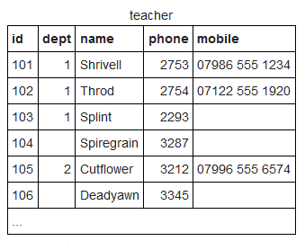
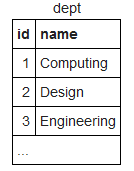

de las que queremos seleccionar los profesores junto con su departamento, pero queremos que salgan tanto los profesores que no tengan departamento asociado
como los que sí tienen, y queremos hacer lo mismo con la tabla departamento. Para obtener tuplas que contengan valores nulos junto con las que no tienen nulos,
empleamos **`LEFT`** o **`RIGHT`** **`JOIN`**, como se ve en los apuntes más adelante, y aunque ésta consulta se puede hacer empleando otras cláusulas de manera
más eficiente, para probar **`UNION`** hacemos dos consultas y unimos sus resultados:

```SQL
SELECT teacher.name AS Teacher, dept.name AS Teacher_Dept
FROM teacher LEFT JOIN dept
                  ON dept.id = teacher.dept
UNION

SELECT teacher.name, dept.name
FROM teacher RIGHT JOIN dept
              ON dept.id = teacher.dept
```

El resultado es el siguiente:

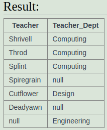

- Cada **`SELECT`** asociado a un **`UNION`** tiene que tener el mismo número de columnas que el otro **`SELECT`** al que se une.
- Las columnas tienen que tener tipos de datos similares.
- Las columnas de cada **`SELECT`** tienen que tener el mismo orden que las columnas del otro **`SELECT`** al que se une.

-> https://www.w3schools.com/sql/sql_union.asp

---

### JOIN, INNER JOIN, LEFT JOIN y RIGHT JOIN

La cláusula JOIN nos permite unir el resultado de dos tablas que están relacionadas y a las que consultamos.

Supongamos las siguientes tablas de ejemplo:

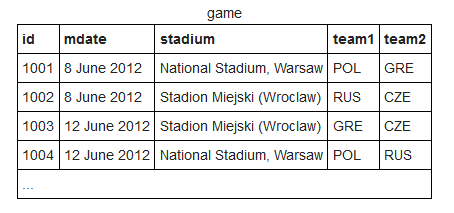
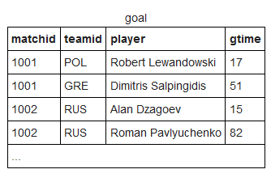
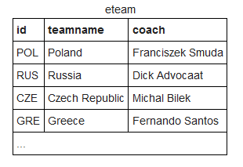

Queremos saber los equipos que se enfrentaban cuando un jugador llamado Mario... marcó algún gol en cualquier partido.
Los datos de los equipos están en la tabla **game**, pero los datos de los jugadores están en la tabla **goal**. Ambas tablas
están relacionadas mediante el id del partido, por lo que al estar relacionadas y como necesitamos datos que se encuentran
en una tabla y en la otra no, podemos unirlas mediante un JOIN, y el punto que las unirá será el atributo que comparten: **id**
como atributo de la tabla **game** y **matchid** como clave foránea en la tabla **goal**:

```SQL
SELECT game.team1, game.team2, goal.player
FROM game JOIN goal ON game.id = goal.matchid
WHERE player LIKE 'Mario%';
```

```SQL
SELECT goal.player, goal.teamid, eteam.coach, goal.gtime
FROM goal JOIN eteam ON goal.teamid = eteam.id
WHERE gtime <= 10;

/*
Devuelve el jugador, su equipo, su entrenador y el minuto en el que se marcó un gol en los primeros diez minutos
de cualquier partido.
*/
```

```SQL
SELECT game.mdate, eteam.teamname
FROM game JOIN eteam ON game.team1 = eteam.id
WHERE eteam.coach = 'Fernando Santos';

--Devuelve las fechas de los partidos, y el nombre del equipo en los que el entrenador del equipo nº1 fue Fernando Santos
```

```SQL
SELECT DISTINCT player
FROM game JOIN goal ON matchid = id
WHERE (team1 = 'GER' OR team2 = 'GER') AND goal.teamid <> 'GER';

--Devuelve todos los jugadores que le han marcado algún gol a Alemania alguna vez.

/*
- Puede ser que algún jugador le haya marcado más de un gol a Alemania y no nos interesa que salga repetido el
mismo jugador por lo que empleamos la función DISTINCT.

- Nos da igual que Alemania sea el primer o el segundo equipo por lo que ponemos la condición de que sea o el primer equipo
o el segundo.

- Finalmente, damos por hecho que Alemania no se marcaría un gol en propia portería por lo que establecemos que el identificador
del equipo que marca no sea alemania.
*/
```

```SQL
SELECT teamname, COUNT(matchid)
FROM eteam JOIN goal ON id=teamid
GROUP BY teamname;

--Devuelve los equipos y su número de goles marcados.

/*
Estamos seleccionando una columna que va a contener varias tuplas y luego empleamos una función reductora que devolverá una sola
tupla, por lo que empleamos la función GROUP BY para que se vayan creando subgrupos en los que concuerden teamname y matchid y así
la consulta se ejecutará adecuadamente.
*/
```

```SQL
SELECT stadium, COUNT(matchid)
FROM game JOIN goal ON id = matchid
GROUP BY stadium;

--Devuelve los estadios y el número de goles marcados en cada uno
```

```SQL
SELECT matchid, mdate, COUNT(matchid)
FROM game JOIN goal ON matchid = id
WHERE (team1 = 'POL' OR team2 = 'POL')
GROUP BY matchid, mdate;

--Por cada partido que involucre a Polonia, muestra el id del partido, la fecha y el número de goles marcados.
```

```SQL
SELECT matchid, mdate, COUNT(matchid)
FROM game JOIN goal ON id = matchid
WHERE (team1 = 'GER' OR team2 = 'GER') AND teamid = 'GER'
GROUP BY matchid, mdate;

--Por cada partido en el que marcó Alemania, muestra el id del partido, la fecha y el número de goles.
```

### JOINs concatenados

Supongamos que tenemos las siguientes tablas:

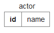
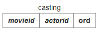
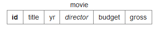

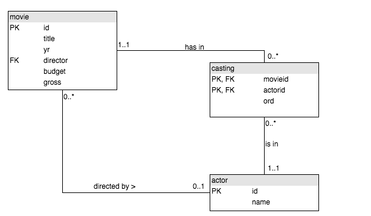

Si quisiéramos saber todas las películas en las que actuó Harrison Ford unimos las tres tablas, ya que están
relacionadas (movie y actor con casting) y por separado no contienen todos los datos que precisamos:

```SQL
SELECT movie.title
FROM actor JOIN casting ON actor.id = casting.actorid
           JOIN movie ON movie.id = casting.movieid
WHERE actor.name = 'Harrison Ford';
```

- Los predicados pueden cambiarse de lugar ... En el FROM o en el WHERE. En el FROM con ON.
- Si la BBDD es muy antigua y no permite el ON, la solución sería poner los predicados en el WHERE con AND.
- Si solo pudiésemos hacer un JOIN, la solución sería hacer subconsultas.
- Se pueden hacer subconsultas después del JOIN.

```SQL
SELECT movie.title
FROM actor JOIN casting JOIN movie
WHERE actor.name = 'Harrison Ford'
AND actor.id = casting.actorid
AND movie.id = casting.movieid;
```

```SQL
SELECT actor.name
FROM actor JOIN casting ON actor.id = casting.actorid
WHERE casting.movieid IN (
                          SELECT movie.id
                          FROM movie
                          WHERE movie.yr = 1962
                        )
AND casting.ord = 1;

--Devuelve los actores que actuaron en películas de 1962 y que tenian el papel principal.
```

```SQL
SELECT movie.title
FROM movie JOIN casting JOIN actor
WHERE casting.ord <> 1
AND actor.name = 'Harrison Ford'
AND actor.id = casting.actorid
AND movie.id = casting.movieid;

--Devuelve las películas en las que actuó Harrison Ford pero no como actor principal.

--Alternativa:

SELECT movie.title
FROM movie JOIN casting ON casting.movieid = movie.id
WHERE ord <> 1 AND casting.actorid = (
    SELECT actor.id
    FROM actor
    WHERE actor.name = 'Harrison Ford'
)
```

Los años más ocupados de Rock Hudson:

```SQL
SELECT yr, COUNT(movie.title)
FROM movie JOIN casting ON movie.id = casting.movieid
           JOIN actor   ON casting.actorid = actor.id

WHERE actor.name = 'Rock Hudson'
GROUP BY movie.yr -- Desaparecen los años en los que no actúa || Tantas tablas como años en las actúa; en los que no, no crea subtablas
HAVING COUNT(movie.title) > 2;  -- WHERE no podría llevar el COUNT() porque es un reductor, y estos se utilizan con un HAVING o en el SELECT... + GROUP BY---
```

```SQL
SELECT movie.title, actor.name
FROM movie JOIN casting ON movie.id = casting.movieid
           JOIN actor ON actor.id = casting.actorid
WHERE casting.ord = 1 AND movie.id IN (SELECT movie.id
             FROM movie JOIN casting ON casting.movieid = movie.id                                                                                                                                                         JOIN actor ON actorid = actor.id
             WHERE actor.name = 'Julie Andrews');

--Películas en las que actuó Julie Andrews y su papel principal.
```

Lista de actores ordenada alfabéticamente, que tienen al menos 30 películas como protagonistas:

```SQL
SELECT actor.name
FROM actor JOIN casting ON casting.actorid = actor.id
WHERE casting.ord = 1
GROUP BY actor.name
HAVING COUNT(actor.name) >= 30
ORDER BY actor.name;
```

Lista de películas de 1978 ordenadas por número de actores y luego por título:

```SQL
SELECT movie.title, COUNT(actor.name)
FROM movie JOIN casting ON casting.movieid = movie.id
           JOIN actor ON casting.actorid = actor.id

WHERE movie.yr = 1978
GROUP BY movie.title
ORDER BY COUNT(actor.name) DESC, movie.title ASC;
```

Lista de personas que han trabajado con Art Garfunkel:

```SQL
SELECT DISTINCT A1.name
FROM actor AS A1 JOIN casting AS C1
                 ON C1.actorid = A1.id
                 JOIN casting AS C2
                 ON C1.movieid = C2.movieid
                 JOIN actor AS A2
                 ON A2.id = C2.actorid

WHERE A1.id <> A2.id AND A2.name = 'Art Garfunkel';

/*
Renombramos las tablas para tener dos instancias de la si misma y luego establecemos que el
id de los actores no pueda ser el mismo (Art Garfunkel no trabaja consigo mismo) y que el nombre del
actor de una de las instancias sea Art Garfunkel.
*/
```

### INNER JOIN, LEFT JOIN y RIGHT JOIN

INNER JOIN funciona igual que un simple JOIN, solo que este no incluye las tuplas que tengan algún dato sin valor.

Tablas de ejemplo:


La siguiente consulta mostrará los profesores y sus departamentos, pero no mostrará los profesores que no tengan departamento
o los departamentos que no tengan profesores:

```SQL
SELECT teacher.name, dept.name
FROM teacher INNER JOIN dept
                   ON (teacher.dept=dept.id);
```

Si queremos incluir todos los campos de una tabla aunque alguno esté vacío empleamos LEFT JOIN o RIGHT JOIN dependiendo
de en qué lado hayamos puesto la tabla que consultamos:

```SQL
SELECT teacher.name, dept.name
FROM teacher LEFT JOIN dept ON teacher.dept = dept.id;

--Devuelve los profesores y sus departamentos, incluyendo los profesores que no tengan departamento.
```

```SQL
SELECT teacher.name, dept.name
FROM teacher RIGHT JOIN dept ON teacher.dept = dept.id;

--Devuelve los profesores y sus departamentos, incluyendo los departamentos que estén vacíos.
```

---

Si queremos seleccionar una columna que puede tener un campo vacío, ese campo lo podemos renombrar con la función **`COALESCE`**:

```SQL
SELECT teacher.name, COALESCE(teacher.mobile, '07986 444 2266')
FROM teacher;
```

---

```SQL
SELECT teacher.name, COALESCE(dept.name, 'None') AS dept
FROM teacher LEFT JOIN dept ON teacher.dept = dept.id;

/*
Devuelve una lista con todos los profesores y sus departamentos y en el caso de que no haya departamento sustituye
el campo vacío por 'None'.
*/
```

---

## CASE

La función CASE nos permite emplear condicionales:

```SQL
SELECT name,  --Muestra el nombre de los profesores
CASE
       WHEN teacher.dept = 1 OR teacher.dept = 2  --Si el departamento es el 1 o el 2...
       THEN 'Sci' --Entonces devuelve Sci
       ELSE 'Art' --Sino, Art
END --Fin de los condicionales
FROM teacher;
```

```SQL
SELECT name,
CASE
       WHEN teacher.dept = 1 OR teacher.dept = 2
       THEN 'Sci'
       WHEN teacher.dept = 3
       THEN 'Art'
       ELSE 'None'  --Opción por defecto
END
FROM teacher;
```

---

## Self JOIN

El auto JOIN es un simple JOIN utilizado para unir una tabla consigo misma, pero con otro nombre para diferenciarse
y con el propósito de comparar datos dentro de la misma tabla.

Tablas de ejemplo:

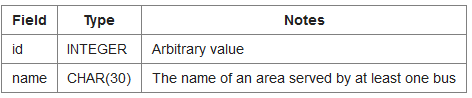
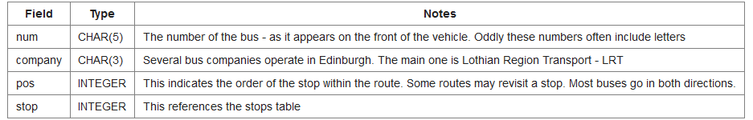

[Ejercicio en SQLZoo](https://sqlzoo.net/wiki/Self_join)

Mostrar todos los servicios de Craiglockhart a London Road:

```SQL
SELECT a.company, a.num, a.stop, b.stop
FROM route a JOIN route b
             ON (a.company=b.company AND a.num=b.num)
WHERE a.stop=53 AND b.stop = 149;

/*
Queremos los servicios de buses que nos llevarían de Craiglockhart (parada 53) a London Road (149). Toda la información que precisamos
está en la misma tabla, pero queremos que esa misma tabla nos de información de datos internos que comparten atributos
(a.company=b.company y a.num=b.num) y diferencian en un punto o más en concreto (a.stop=53 AND b.stop = 149). Necesitamos dos instancias
de la misma tabla por lo que hacemos un self join de la tabla 'route' y renombramos las instancias como 'a' y 'b'.
*/
```

Si queremos referirnos a las paradas por su nombre y no por su id, transformamos la consulta de la siguiente manera:

```SQL
SELECT a.company, a.num, stopa.name, stopb.name
FROM route a JOIN route b ON (a.company=b.company AND a.num=b.num)
             JOIN stops stopa ON (a.stop=stopa.id)
             JOIN stops stopb ON (b.stop=stopb.id)
WHERE stopa.name='Craiglockhart' AND stopb.name = 'London Road';

/*
Unimos la tabla 'route' con la tabla 'stops', ya que ambas están relacionadas (el atributo id como clave foránea en la tabla stops) y la
tabla stops relaciona el id con un nombre, que será el nombre de la parada.
*/
```

Lista de todos los servicios que conectan las paradas 115 y 137 ('Haymarket' y 'Leith'):

```SQL
SELECT DISTINCT a.company, a.num
FROM route a JOIN route b ON (a.company=b.company AND a.num=b.num)
WHERE a.stop=115 AND b.stop = 137;
```

Lista de las paradas a las que se puede llegar desde 'Craiglockhart' tomando un solo bus, incluyendo 'Craiglockhart' y ofrecidas por la compañía LRT:

```SQL
SELECT DISTINCT stopb.name, a.company, a.num
FROM route a JOIN route b ON (a.company = b.company AND a.num = b.num)
             JOIN stops AS stopa ON a.stop = stopa.id
             JOIN stops AS stopb ON b.stop = stopb.id

WHERE stopa.name = 'Craiglockhart' AND a.company = 'LRT';
```

Rutas que implican tomar dos buses y que pueden ir desde Craiglockhart a Lochend. Se muestra el número de bus y la compañía para el primer bus, el nombre
de la parada de la transferencias, y el número de bus y la compañía para el segundo bus:

```SQL
SELECT DISTINCT a.num, a.company, stop_a.name, a_2.num, a_2.company
FROM (route a JOIN route b ON (a.company = b.company AND a.num = b.num)
              JOIN stops stop_a ON stop_a.id = a.stop
              JOIN stops stop_b ON stop_b.id = b.stop)

              JOIN (route a_2 JOIN route b_2
                              ON (a_2.company = b_2.company AND a_2.num = b_2.num)
                              JOIN stops stop_a_2 ON stop_a_2.id = a_2.stop
                              JOIN stops stop_b_2 ON stop_b_2.id = b_2.stop)

              ON (stop_a.id = stop_a_2.id)

WHERE stop_b.name = 'Craiglockhart' AND stop_b_2.name = 'Lochend'
ORDER BY a.num, a.company, stop_a.name, a_2.num, a_2.company;

/*
Esta consulta fue especialmente complicada de realizar. Lo mejor es ir dividiendo el problema general en partes pequeñas e irlas resolviendo y al final
unir todo en una única solución.

-> Lo primero que tenemos que hacer es seleccionar los datos que se nos pide: DISTINCT a.num, a.company, stop_a.name, a_2.num, a_2.company (utilizamos DISTINCT
para evitar que nos salga tuplas repetidas).

-> A continuación vemos a qué tablas pertenecen esos datos que nos piden: 'route' y 'stops'. Se nos pide las rutas que implican tomar dos buses y en las que se puede ir desde Craiglockhart a Lochend; datos de una misma tabla unida a otra (stops unida a route, utilizando el atributo name), por lo que ya sabemos que tenemos que emplear un self JOIN para ambas paradas y un
JOIN para referenciarlas con un nombre.

-> Después de seleccionar los datos intentamos analizar la semántica del ejercicio y nos damos cuenta de que en realidad sería simplemente repetir toda la selección
de datos, ya que solo relacionando las dos tablas nos saldría el resultado de consultar rutas que impliquen tomar un solo bus, como en el ejercicio anterior, y en este
nos piden dos buses por ruta, pero esos buses a vez tienen que estar relacionados entre sí, por lo que unimos las dos estructuras (con los nombres de las columnas cambiados
para evitar un error de ambiguedad) en un único punto, las paradas iniciales.

La cuestión estaría en la unión de las dos tablas en un punto en concreto. Partimos con dos rutas a y a_2 que implica, al haber dos instancias de la misma
tabla más otra, el utilizar dos buses. El primer bus, según los datos de la ruta a, puede llegar hasta Craiglockhart y el segundo, según los datos de la ruta a_2, puede
llegar hasta Lochend. Como hemos unido los datos de las dos tablas, tenemos que utilizando dos buses podemos llegar tanto a Craiglockhart como a Lochend, y como
la primera ruta puede llegar a tener como primera parada Craiglockhart (no especificamos que stop_a.name no pueda ser Craiglockhart), resulta que siendo ésta la primera
parada y aún siendo la segunda parada de la segunda ruta, Lochend, tenemos que podemos llegar desde Craiglockhart hasta Lochend utilizando dos buses como resultado
de las dos intancias de las tablas más la tabla stops.

En resumen: queremos utilizar dos buses que implican ir por dos rutas distintas para llegar a dos destinos distintos y teniendo la posibilidad de llegar desde uno de estos
destinos hasta el otro. El primer bus, que va en la ruta a, puede llegar hasta Craiglockhart, y el segundo bus, que va con la ruta a_2, puede llegar hasta Lochend.
Para llegar a tener la posibilidad de disponer de dos buses distintos, tenemos que unir la selección de datos que implican ambos buses, y esto lo hacemos haciendo que la
consulta nos devuelva la unión de ambos buses solo cuando esos buses, en su parada inicial, sean los mismos. La cuestión sería tomar el bus de ambas paradas iniciales. Como
no especificamos que la parada de destino de la primera ruta no puediese ser la misma parada inicial de la ruta, este parada se puede comportar como la parada inicial y al
aún tener como parada de destino en la segunda ruta a Lochend, al unir los datos vemos que obtenemos los buses que nos podrian llevar desde Craiglockhart hasta Lochend.
*/
```
