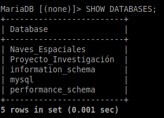
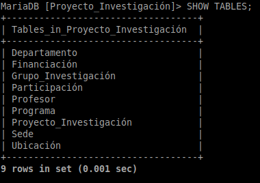
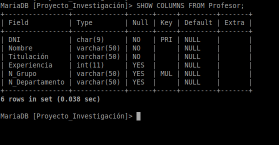
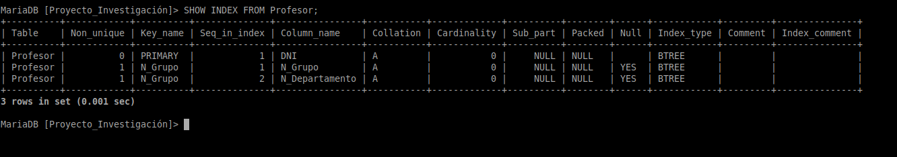
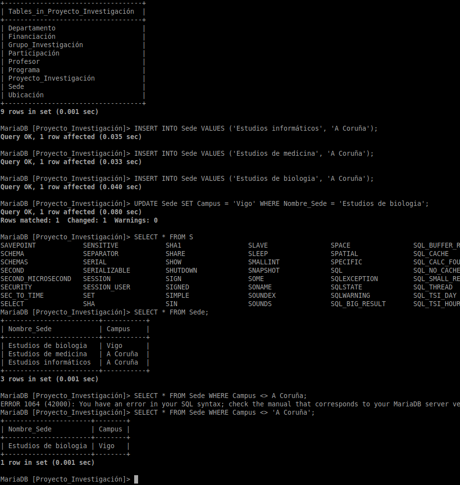
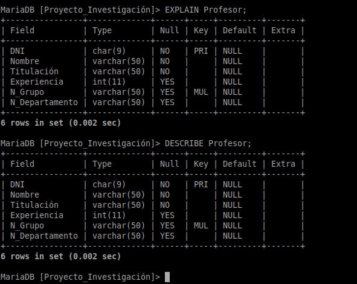

# Comandos de MariaDB para visualizar la estructura y los datos de una BBDD :notebook: 

- **[Sentencias SQL para administrar MariaDB](https://mariadb.com/kb/en/administrative-sql-statements/)**
- **[Comandos de la sentencia `SHOW` para visualizar estructura y datos](https://mariadb.com/kb/en/show/)**

**MariaDB viene por defecto con sentencias SQL para administrar el sistema gestor. Con estas sentencias se puede desde hacer backups hasta administrar plugins.**
**En este caso veremos algunos de los comandos de que disponemos de la sentencia `SHOW` para ejecutar desde la terminal de MariaDB, y que nos permitirán visualizar**
**la estructura de nuestra base de datos y sus objetos, y también sus datos.**

---

## Sentencia `SHOW`

**La sentencia `SHOW` tiene la siguiente sintaxis:**

```SQL
SHOW [(FUNCIÓN|ATRIBUTO)|OBJETO];

-- Función: una función nos devuelve resultados en base a la tabla o a la misma base de datos
-- Atributo: nos devuelve alguna/s característica/s de una tabla o base de datos
-- Objeto: bases de datos, tablas o columnas
```

### Comandos

#### DATABASES

**El comando DATABASES nos devuelve las bases de datos presentes en el sistema:**

```SQL
SHOW DATABASES;
```



#### TABLES

**El comando TABLES nos devuelve las tablas presentes en una BBDD:**

```SQL
SHOW TABLES;
```



#### COLUMNS [FROM]

**El comando COLUMNS nos devuelve las columnas presentes en una tabla, así como el dominio, los atributos que admiten valores nulos, cual es la clave primaria y valores por defecto entre otros:**

```SQL
SHOW COLUMNS FROM Profesor;
```



#### INDEX [FROM]

**El comando INDEX nos devuelve la información de indexado de una tabla:**

```SQL
SHOW INDEX FROM Profesor;
```



## Sentencia `SELECT`

**La sentencia `SELECT` no es parte de las sentencias propias de MariaDB para su administración, es una sentencia perteneciente al [sublenguaje DQL de SQL](../SQL-DQL.md), aunque**
**igualmente lo podemos utilizar para visualizar las tablas y sus datos de una BBDD:**



## Sentencias `DESCRIBE` y `EXPLAIN`

**Estas sentencias son un atajo al comando `SHOW COLUMNS FROM`... `DESCRIBE` también muestra información sobre las [vistas](https://mariadb.com/kb/en/views/):**



